# Hi there, I'm BestWaveRock 👋 

  

  <a href="https://github.com/BestWaveRock">
    
    
    
  

---

### 💫 About Me

I am a Software Engineer passionate about creating polished, high-performance desktop and TV experiences, frontend engineering, and exploring AI technologies. I enjoy breathing life into applications through dynamic UI animations and modern, premium design standards.

- 📺 **Apple TV & iOS**: Sideloading tools ([atvloadly](https://github.com/BestWaveRock/atvloadly)), client development ([ATV-Bilibili-demo](https://github.com/BestWaveRock/ATV-Bilibili-demo)).
- 💻 **Desktop Enhancement**: Enhancing desktop experiences for devices ([AirPodsDesktop](https://github.com/BestWaveRock/AirPodsDesktop) for Windows/Linux).
- 🌐 **Web & Apps**: Building responsive SPA and Nuxt/Vue applications ([aipan-netdisk-search](https://github.com/BestWaveRock/aipan-netdisk-search), [aliyunpan](https://github.com/BestWaveRock/aliyunpan)).
- 🤖 **AI & Media**: Speeding up AI landing implementations ([AIAS](https://github.com/BestWaveRock/AIAS)), media servers ([ABLMediaServer](https://github.com/BestWaveRock/ABLMediaServer)).

---

### 🛠️ Tech Stack & Skills

  

---

### 📊 GitHub Analytics

  
  

  

---

### 📂 Featured Projects

| Project | Description | Tech Stack |
| :--- | :--- | :--- |
| ☄️ [**AirPodsDesktop**](https://github.com/BestWaveRock/AirPodsDesktop) | AirPods desktop user experience enhancement program for Windows and Linux. | C++ / Qt / Electron |
| 📺 [**ATV-Bilibili-demo**](https://github.com/BestWaveRock/ATV-Bilibili-demo) | BiliBili Client Demo for Apple TV (tvOS). | Swift / Apple TV UI |
| 🔍 [**aipan-netdisk-search**](https://github.com/BestWaveRock/aipan-netdisk-search) | Nuxt.js/Vue-based network disk search engine. | Vue / Nuxt / Node.js |
| 💾 [**aliyunpan**](https://github.com/BestWaveRock/aliyunpan) | Aliyunpan desktop client core and client fork optimizations. | TypeScript / React / Electron |
| ⚡ [**atvloadly**](https://github.com/BestWaveRock/atvloadly) | Easily sideload IPA applications to Apple TV. | Python / Apple TV APIs |

---

### 🤝 Connect with Me

- 📧 **Email**: [liangjiaxin1@e-byte.com](mailto:liangjiaxin1@e-byte.com)
- 🌐 **GitHub Profile**: [github.com/BestWaveRock](https://github.com/BestWaveRock)

(<a href="#top">back to top</a>)

